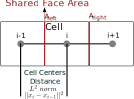

Heat Diffusion
==============

This section focuses on the heat diffusion equation and its discretization in three dimensions, including the generic form of the governing equation and the linearized source term.

Generic Form of the Heat Diffusion Equation
-------------------------------------------

The heat diffusion equation in three dimensions can be written as:

.. math::

    \rho c_p \frac{\partial T}{\partial t} = \frac{\partial}{\partial x_i}(k \frac{\partial T}{\partial x_i}) + S_T

where:

- :math:`T` is the temperature (dependent variable).
- :math:`\alpha` is the thermal diffusivity (:math:`\alpha = \frac{k}{\rho c_p}`).
- :math:`S_T` is a source term.

In steady-state conditions, the time-dependent term vanishes:

.. math::

    \frac{\partial}{\partial x_i}(k \frac{\partial T}{\partial x_i}) + S_T = 0

Discretization in 3D
--------------------

The discretization in 1-D follows the scheme as shown in the image. Using the finite volume method (FVM), the diffusion equation is discretized over a control volume. The discretization involves integrating the equation over the control volume and applying Gauss's divergence theorem:

   
.. math::

    \int_{\Delta V} \left[\frac{\partial}{\partial x}\left(k \frac{\partial T}{\partial x}\right) + S_T\right] dV = 0

.. math::
    \Rightarrow \int_A \left[k \frac{\partial T}{\partial x} \right] \cdot \mathbf{n} \ dA + S_T \Delta V = 0

.. math::
    \Rightarrow \left[kA \frac{\partial T}{\partial x} \right]_{A_{right}} - \left[kA \frac{\partial T}{\partial x} \right]_{A_{left}} + S_T \Delta V = 0    

Considering :math:`S_T \Delta V = S_u + S_i T_i` for a dependent source variable

.. math::
    \Rightarrow \left[kA \frac{\partial T}{\partial x} \right]_{A_{right}} - \left[kA \frac{\partial T}{\partial x} \right]_{A_{left}} + S_u + S_i T_i = 0    

Now

- :math:`\left[\frac{\partial T}{\partial x} \right]_{A_{right}} = \frac{T_{i+1}-T_i}{||x_{i+1} - x_i||^2}`
- :math:`\left[\frac{\partial T}{\partial x} \right]_{A_{left}} = \frac{T_{i}-T_{i-1}}{||x_i-x_{i-1}||^2}`
- :math:`k|_{A_{right}}=\frac{k_{i+1}+k_i}{2}`
- :math:`k|_{A_{left}}=\frac{k_{i}+k_{i-1}}{2}`

.. math::
    \begin{aligned}
        & \left[kA \frac{T_{i+1}-T_i}{||x_{i+1} - x_i||^2} \right ] - \left[kA \frac{T_{i}-T_{i-1}}{||x_i-x_{i-1}||^2} \right] + S_u + S_i T_i & = 0 \\
        \Rightarrow & \left[ \frac{kA_{right}}{||x_{i+1} - x_i||^2} \right]T_{i+1} + \left[-\frac{kA_{left}}{||x_{i} - x_{i-1}||^2} -\frac{kA_{right}}{||x_{i+1} - x_i||^2} + S_i \right]T_{i} \\
            & \hspace{6.25 cm} + \left[ \frac{kA_{left}}{||x_{i} - x_{i-1}||^2} \right]T_{i-1} & = -S_u \\
        \Rightarrow & \sum_{j=1}^n\left[ \frac{k_{i \leftrightarrow j}A_{i \leftrightarrow j}}{||x_{i} - x_{j}||^2} \right]T_{j} -\sum_{j=1}^n\left[\left(\frac{k_{i \leftrightarrow j}A_{i \leftrightarrow j}}{||x_{i} - x_{j}||^2}\right) + S_i  \right]T_{i} & = -S_u \\    
    \end{aligned}

Here considering a list of shared cells are :math:`\mathcal{J}` for a given cell :math:`i` and :math:`j` is the index of the shared cells.

.. math::
    \begin{aligned}
        a_{ij} &= k_{i \leftrightarrow j} \frac{A_{i \leftrightarrow j}}{||x_{i} - x_{j}||^2}, \quad \forall j \in \mathcal{J} \\
        a_{ii} &= -\sum_{j \in \mathcal{J}}\left[\frac{k_{i \leftrightarrow j}A_{i \leftrightarrow j}}{||x_{i} - x_{j}||^2}\right] - S_i \\
        b_{i} &= -[S_u]_{i} \\
    \end{aligned}

Boundary Conditions
---------------------

The elements of the sparse matrix changes slightly when boundary conditions are handled.

1. Dirichlet Boundary Condition
^^^^^^^^^^^^^^^^^^^^^^^^^^^^^^^^
For a list of boundary faces defined with :math:`\mathcal{B}` and indexed with :math:`b` for a cell indexed with :math:`i`

.. math::
    \begin{aligned}
        a_{ij} &= k_{i \leftrightarrow j} \frac{A_{i \leftrightarrow j}}{||x_{i} - x_{j}||^2}, \quad \forall j \in \mathcal{J} \\
        a_{ii} &= -\sum_{j \in \mathcal{J}}\left[\frac{k_{i \leftrightarrow j}A_{i \leftrightarrow j}}{||x_{i} - x_{j}||^2}\right] -\sum_{b \in \mathcal{B}}\left[\frac{k_{i \leftrightarrow b}A_{i \leftrightarrow b}}{||x_{i} - x_{b}||^2}\right] - S_i \quad \forall b \in \mathcal{J, B} \\
        b_{i} &= -[S_u]_{i} - k_{i \leftrightarrow b} \frac{A_{i \leftrightarrow b}}{||x_{i} - x_{b}||^2} \cdot T_b, \quad \forall k \in \mathcal{B} \\
    \end{aligned}

2. Neumann Boundary Condition
^^^^^^^^^^^^^^^^^^^^^^^^^^^^^^
If a boundary surface is kept at :math:`T_\infty` with a convective coefficient :math:`h`, the equation becomes:

.. math::
    \begin{aligned}
        a_{ij} &= k_{i \leftrightarrow j} \frac{A_{i \leftrightarrow j}}{||x_{i} - x_{j}||^2}, \quad \forall j \in \mathcal{J} \\
        a_{ii} &= -\sum_{j \in \mathcal{J}}\left[\frac{k_{i \leftrightarrow j}A_{i \leftrightarrow j}}{||x_{i} - x_{j}||^2}\right] -\sum_{b \in \mathcal{B}}A_{i \leftrightarrow b}\left[\frac{k_{i \leftrightarrow b}}{||x_{i} - x_{b}||^2} + h \right] - S_i \quad \forall b \in \mathcal{J, B} \\
        b_{i} &= -[S_u]_{i} - k_{i \leftrightarrow b} \frac{A_{i \leftrightarrow b}}{||x_{i} - x_{b}||^2} \cdot T_b - hA_{i \leftrightarrow b} \cdot T_{\infty}, \quad \forall k \in \mathcal{B} \\
    \end{aligned}

If a boundary is kept at a fixed temperature :math:`T_s` then :math:`T_b = T_b`, but if the surface is allowed to convect :math:`T_b=0`.

Generalization
----------------

The following equations are the general form of heat diffusion equation. Notice :math:`q_i` as the source heat per unit volume and :math:`\delta V` as the volume of the cell.

.. math::
    \begin{aligned}
        a_{ij} &= k_{i \leftrightarrow j} \frac{A_{i \leftrightarrow j}}{||x_{i} - x_{j}||^2}, \quad \forall j \in \mathcal{J} \\
        a_{ii} &= -\sum_{j \in \mathcal{J}}\left[\frac{k_{i \leftrightarrow j}A_{i \leftrightarrow j}}{||x_{i} - x_{j}||^2}\right] -\sum_{b \in \mathcal{B}}A_{i \leftrightarrow b}\left[\frac{k_{i \leftrightarrow b}}{||x_{i} - x_{b}||^2} + h \right] - S_i \quad \forall b \in \mathcal{J, B} \\
        b_{i} &= -[S_u]_{i} - q_{i} \cdot \delta V - k_{i \leftrightarrow b} \frac{A_{i \leftrightarrow b}}{||x_{i} - x_{b}||^2} \cdot T_b - hA_{i \leftrightarrow b} \cdot T_{\infty}, \quad \forall k \in \mathcal{B} \\
    \end{aligned}

These equation covers all the cases and reduces to desired formulation

Here: 

- :math:`a_{ij}` is element of A matrix at row i and column j.
- :math:`k_{i \leftrightarrow j}` is the thermal conductivity.
- :math:`||x_{i} - x_{j}||^2` is the Euclidean distance between points :math:`i` and :math:`j`.
- :math:`h` is the convective heat transfer coefficient.
- :math:`S_i` is the temperature dependent heat source.
- :math:`[S_u]_{i}` is the independent heat source.
- :math:`q_{i}` is the heat source per unit volume.
- :math:`T_b` is the temperature at the boundary surface.
- :math:`T_{\infty}` is the ambient temperature.

1. If :math:`h=0`, equation takes the Dirichlet BC form.

.. math::
    \begin{aligned}
        a_{ij} &= k_{i \leftrightarrow j} \frac{A_{i \leftrightarrow j}}{||x_{i} - x_{j}||^2}, \quad \forall j \in \mathcal{J} \\
        a_{ii} &= -\sum_{j \in \mathcal{J}}\left[\frac{k_{i \leftrightarrow j}A_{i \leftrightarrow j}}{||x_{i} - x_{j}||^2}\right] -\sum_{b \in \mathcal{B}}\left[\frac{k_{i \leftrightarrow b}A_{i \leftrightarrow b}}{||x_{i} - x_{b}||^2} \right] - S_i \quad \forall b \in \mathcal{J, B} \\
        b_{i} &= -[S_u]_{i} - q_{i} \cdot \delta V - k_{i \leftrightarrow b} \frac{A_{i \leftrightarrow b}}{||x_{i} - x_{b}||^2} \cdot T_b, \quad \forall k \in \mathcal{B} \\
    \end{aligned}

2. If no internal heat generation, i.e. :math:`q_i = 0`, then takes generalized Dirichlet BC form

.. math::
    \begin{aligned}
        a_{ij} &= k_{i \leftrightarrow j} \frac{A_{i \leftrightarrow j}}{||x_{i} - x_{j}||^2}, \quad \forall j \in \mathcal{J} \\
        a_{ii} &= -\sum_{j \in \mathcal{J}}\left[\frac{k_{i \leftrightarrow j}A_{i \leftrightarrow j}}{||x_{i} - x_{j}||^2}\right] -\sum_{b \in \mathcal{B}}\left[\frac{k_{i \leftrightarrow b}A_{i \leftrightarrow b}}{||x_{i} - x_{b}||^2} \right] - S_i \quad \forall b \in \mathcal{J, B} \\
        b_{i} &= -[S_u]_{i} - k_{i \leftrightarrow b} \frac{A_{i \leftrightarrow b}}{||x_{i} - x_{b}||^2} \cdot T_b, \quad \forall k \in \mathcal{B} \\
    \end{aligned}

3. If the cell under consideration is fully internal i.e. not sharing any of the faces with the boundary, the equation takes the generic formulation where fluxes aree coming fromm all of the faces.

.. math::
    \begin{aligned}
        a_{ij} &= k_{i \leftrightarrow j} \frac{A_{i \leftrightarrow j}}{||x_{i} - x_{j}||^2}, \quad \forall j \in \mathcal{J} \\
        a_{ii} &= -\sum_{j \in \mathcal{J}}\left[\frac{k_{i \leftrightarrow j}A_{i \leftrightarrow j}}{||x_{i} - x_{j}||^2}\right] -S_i \\
        b_{i} &= -[S_u]_{i}  \\
    \end{aligned}

4. If there are no dependent source term or independent source term i.e. :math:`S_i=0` and :math:`S_u=0`

.. math::
    \begin{aligned}
        a_{ij} &= k_{i \leftrightarrow j} \frac{A_{i \leftrightarrow j}}{||x_{i} - x_{j}||^2}, \quad \forall j \in \mathcal{J} \\
        a_{ii} &= -\sum_{j \in \mathcal{J}}\left[\frac{k_{i \leftrightarrow j}A_{i \leftrightarrow j}}{||x_{i} - x_{j}||^2}\right] \\
        b_{i} &= 0  \\
    \end{aligned}

Summary
-------

The finite volume discretization of the heat diffusion equation is formulated in a comprehensive fashion considering Dirichlet, Neumann, Heat generation.
