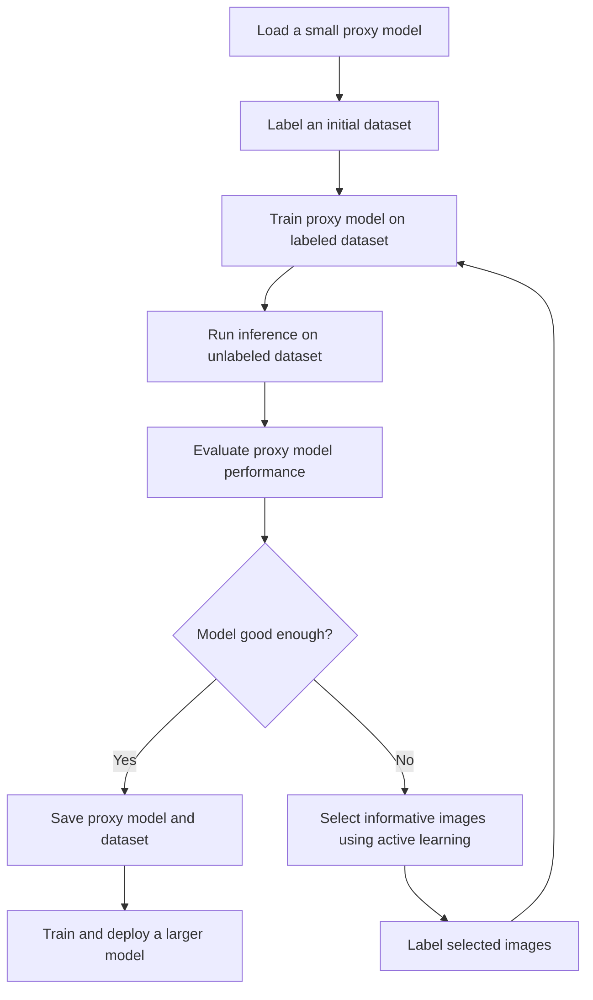
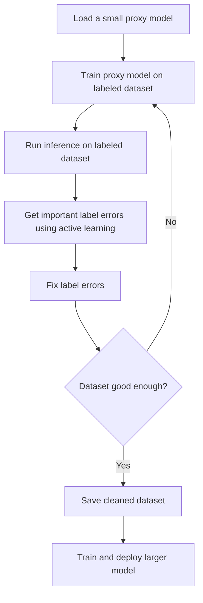

<p align="center">
  
</p>

Active learning at the edge for computer vision.

The goal of this project is to create a framework for active learning at the edge for computer vision. We should be able to train a model on a small dataset and then use active learning to iteratively improve the model all on a local machine.

## Tech Stack

- Training framework: fastai
- User interface: streamlit
- Database: sqlite
- Experiment tracking: wandb

## Installation

PyPI
```bash
pip install active-vision
```

Local install
```bash
git clone https://github.com/dnth/active-vision.git
cd active-vision
pip install -e .
```

## Usage [WIP]

```python
import active_vision as av

# Load a model
model = av.load_model("resnet18")

# Load a dataset
dataset = av.load_dataset(df)

# Inital sampling
dataset = av.initial_sampling(dataset, n_samples=10)

# Train the model
model.train()

# Save the model
model.save()

# Evaluate the model
model.evaluate(df)

# Uncertainty sampling to get the lowest confidence images
model.uncertainty_sampling()

# Diversity sampling to get the most diverse images (outliers)
model.diversity_sampling()

# Random sampling
model.random_sampling()

# Merge the datasets
dataset = av.merge_datasets(dataset, dataset_2)

# Launch a streamlit app to label the images
av.label_images(dataset)
```

## Workflow
There are two workflows for active learning at the edge that we can use depending on the availability of labeled data.

### With unlabeled data
If we have no labeled data, we can use active learning to iteratively improve the model and build a labeled dataset.

1. Load a small proxy model.
2. Label an initial dataset.
3. Train the proxy model on the labeled dataset.
4. Run inference on the unlabeled dataset.
5. Evaluate the performance of the proxy model on the unlabeled dataset.
6. Is model good enough?    
    - Yes: Save the proxy model and the dataset.
    - No: Select the most informative images to label using active learning.
7. Label the most informative images and add them to the dataset.
8. Repeat steps 3-6.
9. Save the proxy model and the dataset.
10. Train a larger model on the saved dataset.



    
### With labeled data
If we have a labeled dataset, we can use active learning to iteratively improve the dataset and the model by fixing the most important label errors.

1. Load a small proxy model.
2. Train the proxy model on the labeled dataset.
3. Run inference on the entire labeled dataset.
4. Get the most important label errors with active learning.
5. Fix the label errors.
6. Repeat steps 2-5 until the dataset is good enough.
7. Save the labeled dataset.
8. Train a larger model on the saved labeled dataset.





## Methodology
To test out the workflows we will use the [imagenette dataset](https://huggingface.co/datasets/frgfm/imagenette). But this will be applicable to any dataset.

Imagenette is a subset of the ImageNet dataset with 10 classes. We will use this dataset to test out the workflows. Additionally, Imagenette has an existing leaderboard which we can use to evaluate the performance of the models.

### Step 1: Download the dataset
Download the imagenette dataset. The imagenette dataset has a train and validation split. Since the leaderboard is based on the validation set, we will evalutate the performance of our model on the validation set to make it easier to compare to the leaderboard.

We will treat the imagenette train set as a unlabeled set and iteratively sample from it while monitoring the performance on the validation set. Ideally we will be able to get to a point where the performance on the validation set is close to the leaderboard with minimal number of labeled images.

I've processed the imagenette dataset and uploaded it to the hub. You can download it from [here](https://huggingface.co/datasets/dnth/active-learning-imagenette).

To load the dataset, you can use the following code:
```python
from datasets import load_dataset

unlabeled_dataset = load_dataset("dnth/active-learning-imagenette", "unlabeled")
eval_dataset = load_dataset("dnth/active-learning-imagenette", "evaluation")
```

### Step 2: Initial Sampling
Label an initial dataset of 10 images from each class. This will give us a small proxy dataset to train our model on. The sampling will be done randomly. There are more intelligent sampling strategies but we will start with random sampling.

### Step 3: Training the proxy model
Train a proxy model on the initial dataset. The proxy model will be a small model that is easy to train and deploy. We will use the fastai framework to train the model. We will use the resnet18 architecture as a starting point. Once training is complete, compute the accuracy of the proxy model on the validation set and compare it to the leaderboard.

> [!TIP]
> With the initial model we got 91.24% accuracy on the validation set. See the [notebook](./nbs/01_initial_sampling.ipynb) for more details.
> | Train Epochs | Number of Images | Validation Accuracy |      Source      |
> |--------------|-----------------|----------------------|------------------|
> | 10           | 100             | 91.24%               | Initial sampling [notebook](./nbs/01_initial_sampling.ipynb) |
> | 80           | 9469            | 94.90%               | fastai |
> | 200          | 9469            | 95.11%               | fastai |


### Step 4: Inference on the unlabeled dataset
Run inference on the unlabeled dataset (the remaining imagenette train set) and evaluate the performance of the proxy model. 

### Step 5: Active learning
Use active learning to select the most informative images to label from the unlabeled set. Pick the top 10 images from the unlabeled set that the proxy model is least confident about and label them.

### Step 6: Repeat
Repeat step 3 - 5 until the performance on the validation set is close to the leaderboard. Note the number of labeled images vs the performance on the validation set. Ideally we want to get to a point where the performance on the validation set is close to the leaderboard with minimal number of labeled images.


After the first iteration we got 94.57% accuracy on the validation set. See the [notebook](./nbs/03_retrain_model.ipynb) for more details.

> [!TIP]
> | Train Epochs | Number of Images | Validation Accuracy |      Source      |
> |--------------|-----------------|----------------------|------------------|
> | 10           | 200             | 94.57%               | First relabeling [notebook](./nbs/03_retrain_model.ipynb) |
