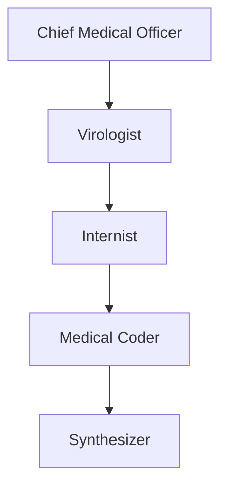
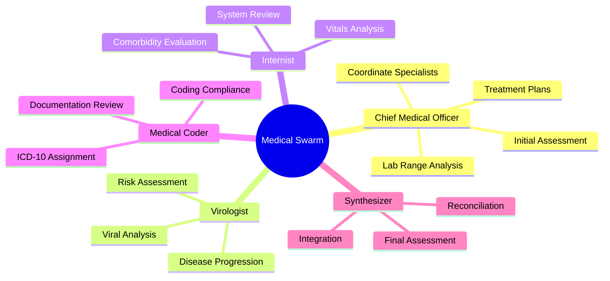
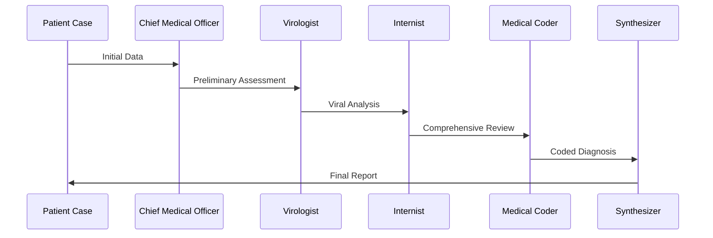

# Medical Diagnosis Swarm Architecture


[](https://discord.gg/agora-999382051935506503) [](https://www.youtube.com/@kyegomez3242) [](https://www.linkedin.com/in/kye-g-38759a207/) [](https://x.com/kyegomezb)

MedicalSwarm is a sophisticated medical diagnosis and coding platform that leverages a coordinated swarm of specialized AI agents to deliver comprehensive medical assessments, accurate ICD-10 coding, and detailed clinical documentation. The system employs a hierarchical approach with specialized agents working in concert to analyze patient data, generate diagnoses, and ensure coding compliance.

## Key Features

### Multi-Agent Architecture

- Chief Medical Officer: Coordinates diagnosis workflow and synthesizes findings
- Virologist: Specializes in viral disease analysis and progression
- Internist: Provides comprehensive internal medicine evaluation
- Medical Coder: Ensures accurate ICD-10 coding and compliance
- Diagnostic Synthesizer: Creates final integrated assessments


### Enterprise Integration

- RAG (Retrieval-Augmented Generation) API support
- Comprehensive logging and telemetry
- Scalable batch processing capabilities
- Configurable output formats and storage


### Clinical Documentation

- Automated ICD-10 code assignment
- Hierarchical Condition Category (HCC) coding
- Evidence-based diagnostic rationale
- Detailed clinical progression timelines


-----

## Installation

```bash
pip install mcs
```

## Onboarding
To get started you must first set some envs in your `.env`

```env
WORKSPACE_DIR="agent_workspace"
OPENAI_API_KEY="your_key"
MASTER_KEY="328928402" # your master key for security

```

## Usage

```python

from mcs.main import MedicalCoderSwarm
import json

if __name__ == "__main__":
  # Example patient case
  patient_case = """
  Patient: 45-year-old White Male
  Location: New York, NY

  Lab Results:
  - egfr 
  - 59 ml / min / 1.73
  - non african-american
  
  """
  
  swarm = MedicalCoderSwarm(patient_id="Patient-001", max_loops=1, patient_documentation="")
  
  swarm.run(task=patient_case)
  
  print(json.dumps(swarm.to_dict()))
```


## Example with HIPPA Grade Security

```python

import json
from mcs.main import MedicalCoderSwarm

if __name__ == "__main__":
    # Extended Example Patient Case
    patient_case = """
    Patient Information:
    - Name: John Doe
    - Age: 45
    - Gender: Male
    - Ethnicity: White
    - Location: New York, NY
    - BMI: 28.5 (Overweight)
    - Occupation: Office Worker

    Presenting Complaints:
    - Persistent fatigue for 3 months
    - Swelling in lower extremities
    - Difficulty concentrating (brain fog)
    - Increased frequency of urination

    Medical History:
    - Hypertension (diagnosed 5 years ago, poorly controlled)
    - Type 2 Diabetes Mellitus (diagnosed 2 years ago, HbA1c: 8.2%)
    - Family history of chronic kidney disease (mother)

    Current Medications:
    - Lisinopril 20 mg daily
    - Metformin 1000 mg twice daily
    - Atorvastatin 10 mg daily

    Lab Results:
    - eGFR: 59 ml/min/1.73m² (Non-African American)
    - Serum Creatinine: 1.5 mg/dL
    - BUN: 22 mg/dL
    - Potassium: 4.8 mmol/L
    - HbA1c: 8.2%
    - Urinalysis: Microalbuminuria detected (300 mg/g creatinine)

    Vital Signs:
    - Blood Pressure: 145/90 mmHg
    - Heart Rate: 78 bpm
    - Respiratory Rate: 16 bpm
    - Temperature: 98.6°F
    - Oxygen Saturation: 98%

    Differential Diagnoses to Explore:
    1. Chronic Kidney Disease (CKD) Stage 3
    2. Diabetic Nephropathy
    3. Secondary Hypertension (due to CKD)
    4. Fatigue related to poorly controlled diabetes

    Specialist Consultations Needed:
    - Nephrologist
    - Endocrinologist
    - Dietitian for diabetic and CKD management

    Initial Management Recommendations:
    - Optimize blood pressure control (<130/80 mmHg target for CKD)
    - Glycemic control improvement (target HbA1c <7%)
    - Lifestyle modifications: low-sodium, renal-friendly diet
    - Referral to nephrologist for further evaluation
    """

    # Initialize the MedicalCoderSwarm with the detailed patient case
    swarm = MedicalCoderSwarm(
        patient_id="Patient-001",
        max_loops=1,
        # patient_documentation=patient_case,
        output_folder_path="reports",
        key_storage_path="example_key.key",
    )

    # Run the swarm on the patient case
    output = swarm.run(task=patient_case)

    # Print the system's state after processing
    print(json.dumps(swarm.to_dict(), indent=4))
```

## Architecture Overview



## Features

- **Specialized Agent Roles**: Each agent has specific medical expertise and responsibilities
- **Structured Diagnostic Flow**: Organized pipeline from initial assessment to final synthesis
- **ICD-10 Coding Integration**: Comprehensive medical coding at each diagnostic stage
- **Automated Report Generation**: Standardized medical and coding reports
- **Evidence-Based Decision Making**: Multi-stage verification and synthesis process

## Agent Responsibilities



## Diagnostic Flow Process




## API Usage
We have established an api in the `/api` folder. To run the api locally you must git clone, and then run:

```bash
cd api

chmod +x bootup.sh

./bootup.sh

```

### API Testing
When you launch your api you can run the tests to see if it works ;)

```bash
cd api

python3 test.py
```

## Docker Usage

To build and run the Docker container for the Medical Coder Swarm, follow these steps:

1. **Build the Docker Image**:
  ```bash
  docker build -t mcs .
  ```

2. **Run the Docker Container**:
  ```bash
  docker run --rm mcs
  ```

## Docker Compose

```bash
docker-compose up
```

### To stop the services, run:
```bash
docker-compose down
```


# Full Diagram

```
graph TB
    subgraph External["External Systems"]
        API[("FastAPI Endpoints")]
        RAG["RAG System"]
        SEC["Security Layer"]
    end

    subgraph Core["Core MCS"]
        MS["MedicalCoderSwarm"]
        AG["AgentRearrange"]
        
        subgraph Agents["Agent Network"]
            CMO["Chief Medical Officer"]
            VIR["Virologist"]
            INT["Internist"]
            MC["Medical Coder"]
            SYN["Synthesizer"]
            SUM["Summarizer"]
        end
        
        subgraph Security["Security Components"]
            SDH["SecureDataHandler"]
            KRP["KeyRotationPolicy"]
        end
        
        subgraph IO["I/O Management"]
            LOG["Logger"]
            FS["File System"]
        end
    end

    %% Connections
    API --> MS
    MS --> AG
    AG --> Agents
    RAG --> MS
    MS --> SDH
    SDH --> KRP
    MS --> LOG
    MS --> FS
    
    %% Agent Flow
    CMO --> VIR
    VIR --> INT
    INT --> MC
    MC --> SYN
    SYN --> SUM
    
    class API,RAG,SEC external
    class MS,AG core
    class SDH,KRP security
    class LOG,FS io


```


## Lab Range Analysis

The system includes specialized functionality for analyzing lab results against diagnostic criteria:

- Automated range checking for common tests (e.g., eGFR)
- Diagnosis-specific range validation
- Multi-factor analysis for complex diagnoses

## Contributing

1. Fork the repository
2. Create your feature branch (`git checkout -b feature/AmazingFeature`)
3. Commit your changes (`git commit -m 'Add some AmazingFeature'`)
4. Push to the branch (`git push origin feature/AmazingFeature`)
5. Open a Pull Request

## License

This project is licensed under the MIT License - see the [LICENSE.md](LICENSE.md) file for details

## Acknowledgments

- Built with the Swarms framework
- Utilizes GPT-4 for advanced medical reasoning
- ICD-10 coding standards compliance

## Contact

For questions and support, please open an issue in the repository.
