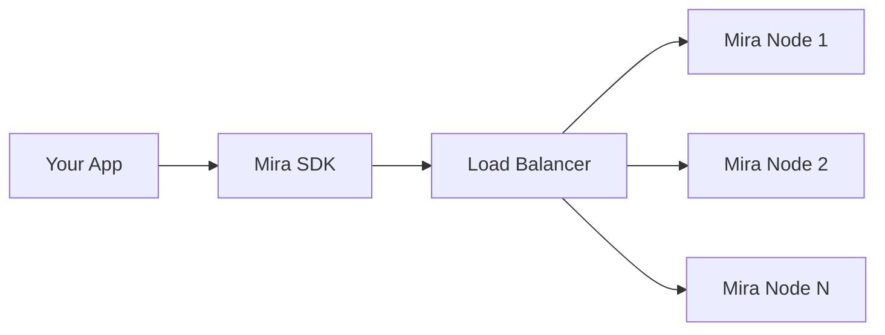

<div align="center">
  
  <h1>Mira Network Python SDK</h1>
  <p><strong>Your Universal Gateway to AI Language Models</strong></p>
</div>

<p align="center">
  <a href="https://badge.fury.io/py/mira-network"></a>
  <a href="https://opensource.org/licenses/MIT"></a>
  <a href="https://github.com/mira-network/python-sdk/actions"></a>
  <a href="https://codecov.io/gh/mira-network/python-sdk"></a>
  <a href="https://pypi.org/project/mira-network/"></a>
  <a href="https://discord.gg/mira-network"></a>
</p>

<p align="center">
  <b>Mira Client enables seamless integration with multiple language models while providing advanced routing, load balancing, and flow management capabilities.</b>
</p>

---

## 🌟 What is Mira Network?

Mira Network is your unified interface to the world of AI language models. It provides:

- 🔄 **Smart Model Routing**: Route requests across different models
- ⚖️ **Load Balancing**: Distribute workload across nodes
- 🌊 **Flow Management**: Handle request patterns efficiently
- 🔌 **Universal Integration**: Single API for multiple models
- 📊 **Usage Tracking**: Monitor your model usage

## Why Mira Network SDK?

| Feature                | Mira SDK                   | Traditional Approach    |
| ---------------------- | -------------------------- | ----------------------- |
| 🔄 Multi-model Support | Single unified API         | Separate APIs per model |
| ⚖️ Load Balancing      | Built-in                   | Custom implementation   |
| 🌊 Flow Control        | Automatic handling         | Manual implementation   |
| 📊 Usage Tracking      | Integrated                 | Custom tracking needed  |
| 🛡️ Error Handling      | Standardized across models | Model-specific handling |

## 🎯 Perfect For

- 🤖 AI Applications
- 📝 Text Generation
- 🔍 Search Enhancement
- 🎮 Interactive Systems

## 🏃 Quick Start

```bash
pip install mira-network
```

```python
from mira_network import MiraClient

async def get_ai_response(prompt):
    async with MiraClient() as client:
        return await client.chat_completions_create(
            model="your-chosen-model",
            messages=[{"role": "user", "content": prompt}]
        )
```

## 🏗️ Architecture



## ✨ Key Features

- 🔌 Simple, intuitive API
- 🔄 Async-first design
- 🌊 Streaming support
- 🔐 Error handling
- 🛠️ Customizable nodes
- 📊 Usage tracking

## 📑 Table of Contents

- [Installation](#installation)
- [Quick Start](#-quick-start)
- [Basic Usage](#-basic-usage)
- [Advanced Usage](#-advanced-usage)
- [API Reference](#-reference)
- [Support](#-support)
- [Contributing](#-contributing)
- [License](#-license)

## 🔧 Installation

Install the SDK using pip:

```bash
pip install mira-network
```

## 🚀 Quick Start

Experience the power of Mira Network in just a few lines of code:

```python
from mira_network import MiraClient

async def main():
    # Initialize with your API key
    client = MiraClient(api_key="your-api-key")

    # Get a response from AI
    response = await client.chat_completions_create(
        model="your-chosen-model",
        messages=[
            {"role": "user", "content": "What is the capital of France?"}
        ]
    )

    # Print the AI's response
    print(response["choices"][0]["message"]["content"])

if __name__ == "__main__":
    import asyncio
    asyncio.run(main())
```

## 📝 Basic Usage

### Having a Conversation

Engage in natural conversations with AI models. The SDK handles the complexities of managing conversation context and model interactions:

```python
response = await client.chat_completions_create(
    model="your-chosen-model",
    messages=[
        {"role": "system", "content": "You are a helpful assistant"},
        {"role": "user", "content": "Hi! Can you help me?"},
    ]
)
```

### Checking Available Models

Explore the diverse range of available AI models:

```python
models = await client.list_models()
print(models)
```

### Checking Your Credits

Monitor your usage and available credits:

```python
credits = await client.get_user_credits()
print(credits)
```

## 🔧 Advanced Usage

### Streaming Responses

Perfect for real-time applications and interactive experiences:

```python
stream = await client.chat_completions_create(
    model="your-chosen-model",
    messages=[
        {"role": "user", "content": "Write a story"}
    ],
    stream=True
)

async for chunk in stream:
    print(chunk["choices"][0]["delta"]["content"], end="")
```

### Custom Mira Nodes

Integrate your preferred Mira nodes seamlessly:

```python
response = await client.chat_completions_create(
    model="your-model",
    messages=[{"role": "user", "content": "Hello"}],
    mira_node={
        "base_url": "https://custom-node.com",
        "api_key": "node-api-key"
    }
)
```

### API Token Management

Secure and flexible token management for your applications:

```python
# Create new token
new_token = await client.create_api_token(
    {"description": "Production API Key"}
)

# List tokens
tokens = await client.list_api_tokens()

# Delete token
await client.delete_api_token("token-id")
```

### Using as Context Manager

Efficient resource management with context managers:

```python
async with MiraClient(api_key="your-api-key") as client:
    response = await client.chat_completions_create(...)
```

## 📚 Reference

### Message Structure

Understanding the core message components:

```python
Message:
    role: str       # "system", "user", or "assistant"
    content: str    # The message content
```

### Error Handling

Robust error handling for production applications:

#### Validation Errors

```python
try:
    response = await client.chat_completions_create(
        model="your-chosen-model",
        messages=[
            {"role": "invalid", "content": "Hello"}  # Invalid role
        ]
    )
except ValueError as e:
    print(f"Validation error: {e}")
```

#### Network Errors

```python
try:
    response = await client.chat_completions_create(...)
except httpx.HTTPError as e:
    print(f"HTTP error: {e}")
```

### Environment Configuration

Flexible configuration options for different environments:

```python
import os
from mira_network import MiraClient

client = MiraClient(
    api_key=os.getenv("MIRA_API_KEY"),
    base_url=os.getenv("MIRA_API_URL", "https://apis.mira.network")
)
```

## 💡 Real-world Examples

### AI-powered Customer Service

```python
async def handle_customer_query(query: str) -> str:
    async with MiraClient() as client:
        response = await client.chat_completions_create(
            model="your-chosen-model",
            messages=[
                {"role": "system", "content": "You are a helpful customer service agent."},
                {"role": "user", "content": query}
            ],
            temperature=0.7,
            max_tokens=150
        )
        return response.choices[0].message.content
```

### Content Generation Pipeline

```python
async def generate_blog_post(topic: str) -> dict:
    async with MiraClient() as client:
        # Generate outline
        outline = await client.chat_completions_create(...)

        # Generate content
        content = await client.chat_completions_create(...)

        # Generate meta description
        meta = await client.chat_completions_create(...)

        return {"outline": outline, "content": content, "meta": meta}
```

## 🤝 Support

For feature requests and bug reports, please visit our [Console Feedback](https://console-feedback.arohalabs.tech/).

## 👥 Contributing

We welcome contributions! Here's how you can help:

1. Fork the repository
2. Create your feature branch (`git checkout -b feature/amazing-feature`)
3. Commit your changes (`git commit -m 'Add amazing feature'`)
4. Push to the branch (`git push origin feature/amazing-feature`)
5. Open a Pull Request

## 📄 License

This project is licensed under the MIT License - see the [LICENSE](LICENSE) file for details.

---

<p align="center">Built with ❤️ by the Mira Network team</p>
