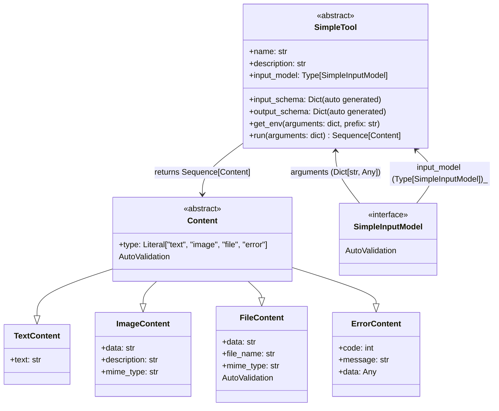

# Simpletool

SimpleTool is a lightweight, async-first Python framework designed for creating simple, strict, and explicit type-safe tools with minimal complexity. It embodies some of the Python design Zen principles, such as "Simple is better than complex" and "Explicit is better than implicit".

## Overview

Simpletool is a powerful SDK that provides a structured approach to building tools with:
- Standardized input and output content types
- Automatic JSON schema generation
- Async support
- Environment variable handling
- Timeout management (def. 60s)

## Example
Check out the [tool_example.py](./tool_example.py) to see how to use Simpletool to create a simple, type-safe tool.

## Architecture Overview



## Core Components

### `SimpleTool` Base Class and Key Features

The `SimpleTool` class provides a robust framework for building tools with the following key features:

- **Input Validation**: 
  - Uses Pydantic models for strict input validation (SimpleInputModel)
  - Automatic type checking and conversion based on Pydantic models
  - SimpleInputModel have own model_json_schema (removes `titles` and `descriptions` from the schema) for easy dump to text schema

- **Output Type Management**: 
  - Supports multiple content types (text, image, file, resource, error) for flexible output representation
  - Strict output type checking allow List or Seqence of Content Types Objects

- **Dynamic Schema Generation**: 

  - Input model needs to be defined as child of `SimpleInputModel` Type and assign to `input_model` attribute inside `SimpleTool` - them magic begins and automaticly:
    - Automatically creates output JSON schemas (`output_schema` / `output_model`) based on the defined `run` method typing 
    - Automatically creates input JSON schemas (`input_schem`a) based on the input model

- **Async Execution**: 
  - Native async/await support
  - Configurable timeout management
  - Contex manager for easy resource management release

- **Environment Integration**: 
  - Easy retrieval of environment variables (`get_env`)
  - Support for random API key selection from provided list (`get_env`)

### Content Types

Simpletool defines several content types to standardize tool inputs and outputs:

- `TextContent`: Represents text-based content
- `ImageContent`: Handles base64 encoded images with optional metadata
- `FileContent`: Represents files with base64 encoded data
- `ResourceContent`: Manages external resource references
- `ErrorContent`: Provides structured error reporting
- `BoolContents`: Simple boolean content type

## Installation

Install the package using pip:

```bash
pip install simpletool
```

## Quick Start

### Creating a Tool

```python
from simpletool import SimpleTool, SimpleInputModel, Sequence, Field
from simpletool.types import TextContent

class InputModel(SimpleInputModel):
    name: str = Field(description="Name to greet")

class MyTool(SimpleTool):
    name = "greeting_tool"
    description = "A simple greeting tool"
    input_model = InputModel

    async def run(self, arguments: dict) -> Sequence[TextContent]:
        # Validation and parsing of input arguments
        arg: InputModel = InputModel(**arguments)

        return [TextContent(text=f"Hello, {arg.name}!")]
```

## Development Guidelines

- Inherit Tool model from `SimpleTool`
- Define an `input_model` using Pydantic (`SimpleInputModel`)
- Implement the `run` method
- Return a list/sequence of content types
- Use async/await for asynchronous operations


## Contributing

Contributions are welcome! Please follow Python best practices and maintain the existing code style.

## License

This project is licensed under the MIT License.

## Contact

Contributions are welcome! Please submit a pull request with your changes.
